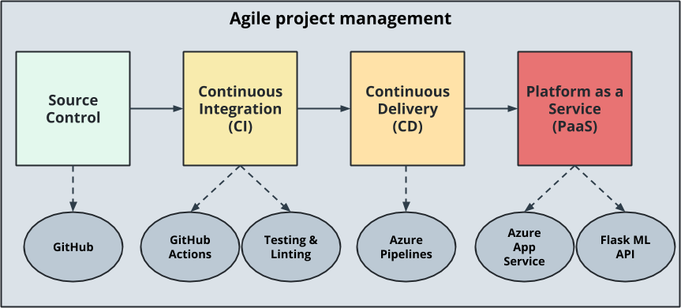
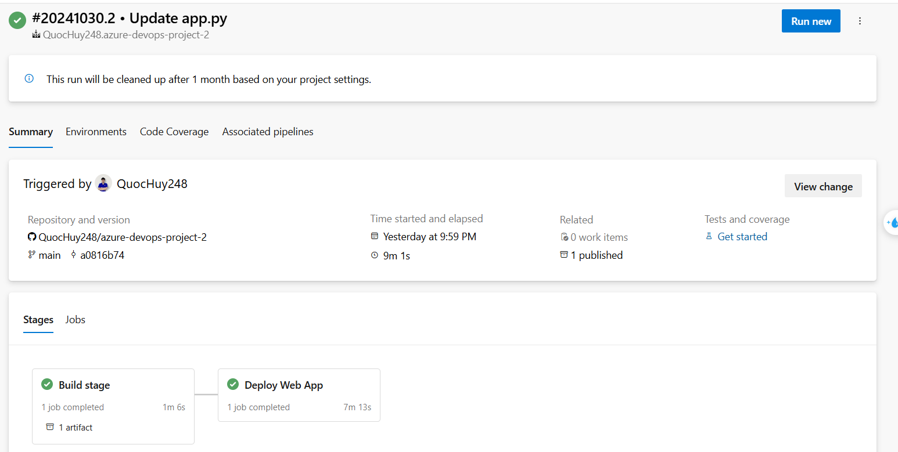
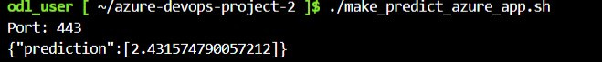
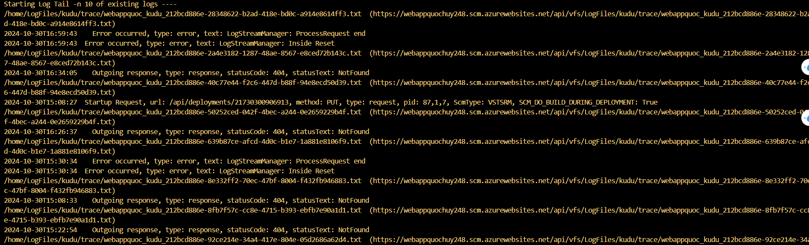

# Overview

This project is a machine learning web application built with Python and deployed through Azure App Service. It features continuous integration and continuous delivery (CI/CD) pipelines to automate the build, testing, and deployment process with each commit. The application uses Flask as its web framework and includes an API that provides predictions based on a machine learning model.

## Project Plan

* **Trello Board**: [Project Trello Board](https://trello.com/b/tu7A1PSM/azure-devops-project)
* **Spreadsheet**: [Project Plan Spreadsheet](https://docs.google.com/spreadsheets/d/1m73sqeMQM7s7Ex0K7paUPcuqVMOtOXPjfVc2ccriPBk/edit?gid=1348135932#gid=1348135932)


## Instructions

### Architectural Diagram
The following diagram illustrates the high-level architecture of the project.



### CI Instructions
1. **Clone the repository**

- Open Azure Cloud Shell and run the following command to clone the project:
   ```bash
   ssh-keygen -t rsa
   cat .ssh/id_rsa.pub
   ```
- Add id_rsa.pub to your Github repo, then run command:
   ```bash
    git clone git@github.com:<your_account>/<your_project>.git
   ```
- Expected output:
   

1. **Create Project Scaffolding**

- Create the Makefile:
    ```Makefile
    install:
	pip install --upgrade pip &&\
		pip install -r requirements.txt

    test:
        python -m pytest -vv test_hello.py

    lint:
        pylint --disable=R,C hello.py

    all: install lint test
    ```

- Create requirements.txt
     ```requirements.txt
    pylint
    pytest
    ```   
- Create the Python Virtual Environment
     ```bash
    python3 -m venv ~/.myrepo
    source ~/.myrepo/bin/activate
    ```   
- Create script file hello.py
     ```python
    def toyou(x):
        return "hi %s" % x

    def add(x):
        return x + 1

    def subtract(x):
        return x - 1
    ``` 
- Create test file test_hello.py
     ```python
    from hello import toyou, add, subtract


    def setup_function(function):
        print("Running Setup: %s" % function.__name__)
        function.x = 10


    def teardown_function(function):
        print("Running Teardown: %s" % function.__name__)
        del function.x


    ### Run to see failed test
    #def test_hello_add():
    #    assert add(test_hello_add.x) == 12

    def test_hello_subtract():
        assert subtract(test_hello_subtract.x) == 9
    ``` 

3. **Local Test** 
- Run command:
    ```bash
    make all
    ```
- Expected output:
   

1. **Enable Github Actions**
- Go to your Github Account and enable Github Actions.

1. **Replace yml code** 
- Replace main.yml to pythonapp.yml in .github\workflows
    ```yml
        name: Python application test with Github Actions

        on: [push]

        jobs:
        build:

            runs-on: ubuntu-latest

        steps:
        - uses: actions/checkout@v2
        - name: Set up Python 3.10
        uses: actions/setup-python@v1
        with:
            python-version: 3.10.15
        - name: Install dependencies
        run: |
            make install
        - name: Lint with pylint
        run: |
            make lint
        - name: Test with pytest
        run: |
            make test
    ```
- Push the changes to GitHub. Github Action will trigger a job. Expected output:
    

### CD Instructions
1. **Clone the repository**
- Run the following command to clone the project:
   ```bash
   git clone https://github.com/udacity/nd082-Azure-Cloud-DevOps-Starter-Code.git
   ```
- Move and delete files to keep only necessary the files:
   ```bash
   cd nd082-Azure-Cloud-DevOps-Starter-Code/C2-AgileDevelopmentwithAzure/project/starter_files/flask-sklearn
   mv * /home/odl_user/azure-devops-project-2
   cd /home/odl_user/azure-devops-project-2
   rm -rf nd082-Azure-Cloud-DevOps-Starter-Code
   ```
- Deploy webapp from Azure CLI with command:
   ```bash
    az webapp up --name webappquochuy248 --resource-group Azuredevops --sku B1 --logs --runtime "PYTHON:3.10"
   ```
- A web app will be created:
   

- Update `<yourappname>` in make_predict_azure_app.sh file. Example: 
    ```bash
     -X POST https://webappquochuy248.azurewebsites.net:$PORT/predict 
    ```
2. **Set up Azure Pipeline**
- Create a new Project in Azure Devops.
- Create a Service Connection with type Azure Resource Manager.
- Create a Enviroment.
- Create a PAT token.
- Create a agent pool.
- create a VM as Agent

3. **Configuration Agent**
- ssh to VM. Example:
    ```bash
    ssh huydhm1@172.212.109.49
    ```
- Install docker and create a permission
    ```bash
    sudo snap install docker
    sudo groupadd docker
    sudo usermod -aG docker $USER
    ```
- Restart VM to apply the changes.
- In DevOps portal, and open the newly created Agent pool to add a new agent and follow instructions.
- Install package and set up enviroment for agent: 
    ```bash
    sudo apt-get update
    sudo apt update
    sudo apt install software-properties-common
    sudo add-apt-repository ppa:deadsnakes/ppa
    sudo apt install python3.10
    sudo apt-get install python3.10-venv
    sudo apt-get install python3-pip
    sudo apt-get install python3.10-distutils
    sudo apt-get -y install zip
    python3.10 -m venv ~/.myagent
    source ~/.myagent/bin/activate
    pip install pylint==3.2.6
    export PATH=$HOME/.local/bin:$PATH
    ```
4. **Create a Azure Pipeline**
- Create a new pipeline in DevOps portal.
- Replace `azure-pipelines.yml` and modify variables for your case. Example:
    ```yml
    trigger:
    - main

    pool: myAgentPool

    variables:
    # Azure Resource Manager connection created during pipeline creation
    azureServiceConnectionId: 'myConnectionService'

    # Web app name
    webAppName: 'webappquochuy248'

    # Environment name
    environmentName: 'flask-ml-service'

    # Project root folder.
    projectRoot: $(System.DefaultWorkingDirectory)

    # Python version: 3.11. Change this to match the Python runtime version running on your web app.
    pythonVersion: '3.10'

    stages:
    - stage: Build
    displayName: Build stage
    jobs:
    - job: BuildJob
        pool: myAgentPool
        steps:    
        - script: |
            python3.10 -m venv ~/.myagent
            source ~/.myagent/bin/activate
            python3.10 -m pip install --upgrade pip
            python3.10 -m pip install setup
            python3.10 -m pip install -r requirements.txt
        workingDirectory: $(projectRoot)

        - script: |
            source ~/.myagent/bin/activate
            export PATH=$HOME/.local/bin:$PATH
            make install
            make lint
        workingDirectory: $(projectRoot)
        displayName: 'Run lint tests'

        - task: ArchiveFiles@2
        displayName: 'Archive files'
        inputs:
            rootFolderOrFile: '$(projectRoot)'
            includeRootFolder: false
            archiveType: zip
            archiveFile: $(Build.ArtifactStagingDirectory)/$(Build.BuildId).zip
            replaceExistingArchive: true

        - upload: $(Build.ArtifactStagingDirectory)/$(Build.BuildId).zip
        displayName: 'Upload package'
        artifact: drop

    - stage: Deploy
    displayName: 'Deploy Web App'
    dependsOn: Build
    condition: succeeded()
    jobs:
    - deployment: DeploymentJob
        pool: myAgentPool
        environment: $(environmentName)
        strategy:
        runOnce:
            deploy:
            steps:
            - task: AzureWebApp@1
                displayName: 'Deploy Azure Web App : flask-ml-service'
                inputs:
                azureSubscription: $(azureServiceConnectionId)
                appName: $(webAppName)
                package: $(Pipeline.Workspace)/drop/$(Build.BuildId).zip
    ```
- Push changes to trigger pipeline. Expected output:
  

- Prediction from deployed flask app in Azure Cloud Shell:
    ```bash
    ./make_predict_azure_app.sh
    ```


- Get streamed log files from deployed application:
    ```bash
    az webapp log tail --name webappquochuy248 --resource-group Azuredevops
    ```



## Enhancements
- Use GitHub Actions handles Continuous Delivery instead of Azure Pipelines.
- Use Kubernetes to deploy app.
- Add more test for CICD.

## Demo 

Link Youtube: [Demo video](https://www.youtube.com/watch?v=8LdqsWskOxQ)

[](https://github.com/QuocHuy248/azure-devops-project-2/actions/workflows/main.yml)


